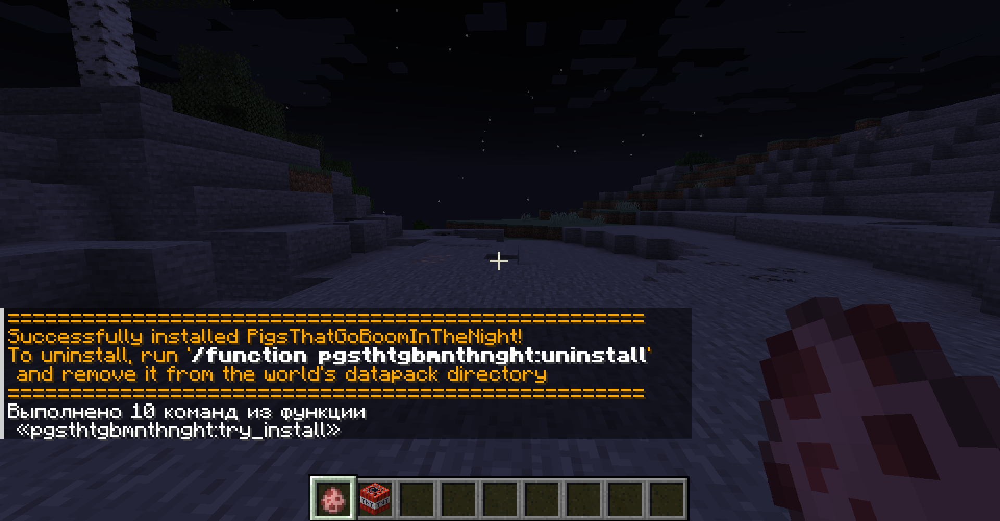
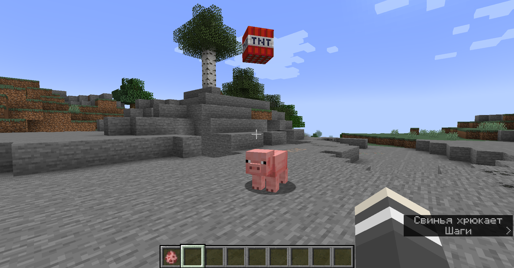
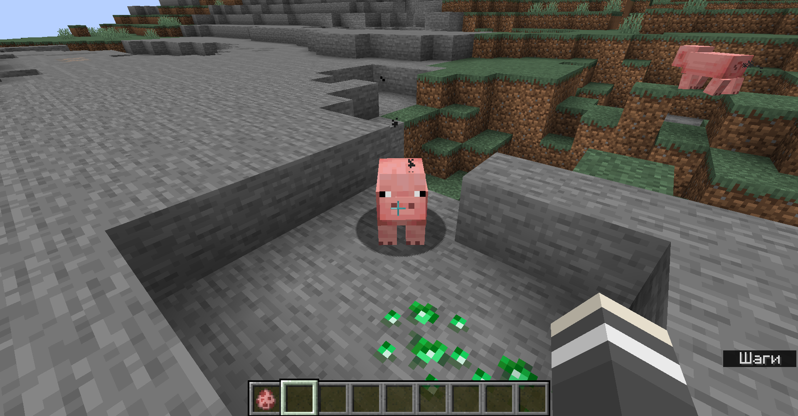
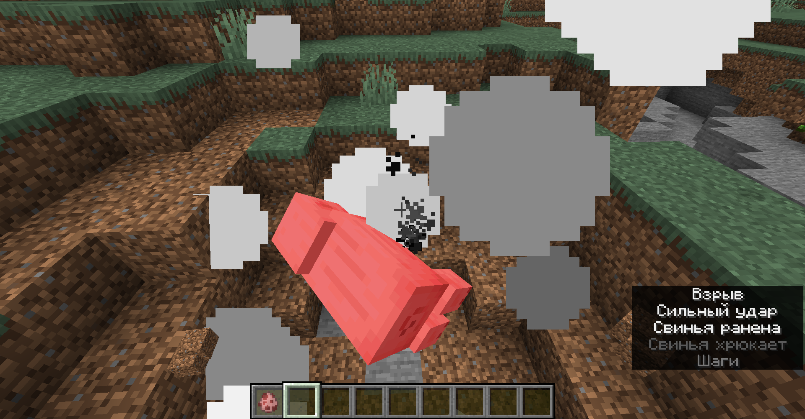

# PigsThatGoBoomInTheNight

A data pack for Minecraft 1.19.X (but will probably work with 1.13+) that allows you to "feed" TNT to pigs (by dropping TNT items onto them) to make them explosive!

Upon taking damage of any kind they will instantly explode.

Any entity can made explosive, except for items and the player that threw the TNT, in the same fashion after running:

```text
/function pgsthtgbmnthnght:toggle_pigs_only
```

Running it again will reenable the filter for pigs only.

## Installation

Grab a version from [RELEASES](https://github.com/ona-li-toki-e-jan-Epiphany-tawa-mi/PigsThatGoBoomInTheNight/releases "PigsThatGoBoomInTheNight Releases Page") and place it inside your world's datapacks folder. [See for more information.](https://minecraft.fandom.com/wiki/Tutorials/Installing_a_data_pack "A Minecraft Wiki tutorial on installing data packs")

The pack will automatically finish installation on world load, but you can force it using (recommended if updating pack):

```text
/function pgsthtgbmnthnght:install/initialize
```

## Uninstallation

To uninstall, you first need to run this command:

```text
/function pgsthtgbmnthnght:install/uninstall
```

After that, remove the datapack from your world's datapacks folder before reloading.

## Links

[Planet Minecraft Page](https://www.planetminecraft.com/data-pack/pigsthatgoboominthenight "PigsThatGoBoomInTheNight on Planet Minecraft")

["Demonstration" Video](https://www.youtube.com/watch?v=PG9h9F2UDsc "PigsThatGoBoomInTheNight 'demonstration' video on YouTube")

## Screenshots






# Changelog

- Optimizations.
